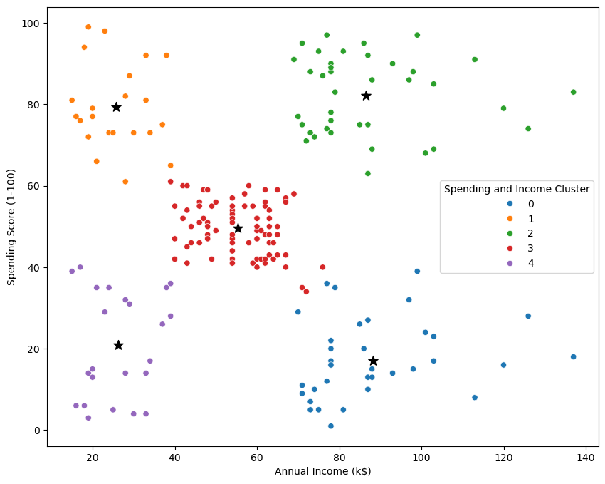

# Customer Clustering Using K-Means Algorithm

## Objective

The goal of this project is to perform customer segmentation using the K-means clustering algorithm. By analyzing customer data, the project groups customers with similar behaviors and characteristics, enabling the implementation of targeted marketing strategies and personalized customer service.

## Tools and Technologies

- **Python**
- **Libraries**:
    - `pandas` for data manipulation
    - `numpy` for numerical operations
    - `matplotlib` and `seaborn` for data visualization
    - `sklearn` for K-means clustering and preprocessing

## Data Overview

The dataset consists of customer data, including demographic details, purchasing behaviors, and other relevant information such as age, income, and spending score.

## Steps in the Analysis Process

### 1. Exploring the Dataset

Before applying clustering, the dataset is explored to:
- Understand its structure
- Check for missing values
- Visualize key patterns

### 2. Applying K-Means Clustering

To determine the optimal number of clusters (K):
1. **Elbow Method**: This method plots the Within-Cluster Sum of Squares (WCSS) for different K values and selects the point where WCSS decreases at a slower rate (the "elbow" point).
2. **Apply K-Means** with the optimal K.

## Results & Insights

### 1. Customer Segmentation

- **Cluster 0 (High Income, Low Spending)**: Cautious spenders, likely to save more.
- **Cluster 1 (Low Income, High Spending)**: Impulse buyers with a high tendency to spend despite limited income.
- **Cluster 2 (High Income, High Spending)**: Premium customers with high disposable income and spending.
- **Cluster 3 (Mid Income, Mid Spending)**: Balanced spenders with moderate income and spending.
- **Cluster 4 (Low Income, Low Spending)**: Budget-conscious shoppers with low income and spending.

### 2. Gender Insights

- **Cluster 4** has the highest percentage of **female customers (61%)**.
- **Cluster 0** has a balanced gender ratio, while others have more female customers.

## Recommendations

### 1. Targeted Marketing

- **Cluster 2**: Promote **luxury products** and **exclusive offers**.
- **Cluster 1**: Use **flash sales** and **loyalty programs**.
- **Cluster 0**: Offer **value-driven bundles** and **investment-worthy deals**.
- **Cluster 3**: Introduce **seasonal offers** and **personalized recommendations**.
- **Cluster 4**: Focus on **affordable pricing** and **essential goods**.

### 2. Retention Strategies

- Implement **personalized offers**, **loyalty programs**, and **subscription models** tailored to each cluster’s spending behavior.

### 3. Gender-Based Approach

- Focus on **female-dominated clusters** (1, 2, 3, 4) with **personalized product recommendations** and **social media engagement**.

You can explore the analysis and code in the [Customer Clustering Notebook](.customer clustering.ipynb) for a detailed breakdown of the steps, including data exploration, clustering, and visualization.

